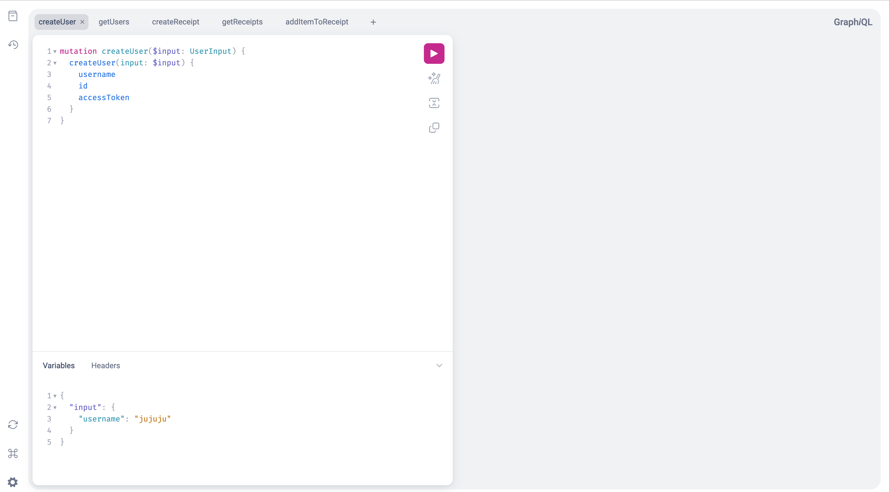

# EZSplit

A project app that makes it easy to split, track and manage bills in a group.

Have you ever found yourself shouldering the bill of your friends at a restaurant and forced to calculate your group's invidividual expenses? Adding insult to injury is when the bill has tax that's excluded from the items.

The goal of this app is to move the responsibility of tracking payments to your friends since they have the knowledge of the items they bought.

# Roadmap
[Coming Soon]

# Getting Started
## Introduction

The backend uses `Go` version 1.21.6. It's not required to download the Go runtime since the project uses docker but you're free to do so if it helps with productivity.

The project uses Graphql for the API. To learn more about the concept, visit https://graphql.org/.

The project uses the gqlgen to help with organizing the queries/mutations and generating the graphql schema. Please check out the library to learn more about the tool's style and convention at https://gqlgen.com/getting-started/


## Requirements

- [Docker](https://docs.docker.com/engine/install/)
- [Task](https://taskfile.dev/installation/)

## Running the app

If Docker and Task are installed, you can start the server using the command

```
task up
```
Verify if the server running:
```
task ping
```

After verifying that the server is running, you need to apply the database schema. Applying the schema will create all the necessary tables needed for development:
```
task apply:db:schema
```

This project uses atlasgo tool to implement a declarative style of db management as opposed to the common versioned style. Read https://atlasgo.io/concepts/declarative-vs-versioned to learn more.

To view the database, the project ships with `pgweb` client which is found on `localhost:8082`

To see more available commands, you can run:
```
task list
```
Or checkout `Taskfile.yml`

## Navigating the codebase

The entrypoint is found in `cmd/ezsplit/main.go`. This convention allows us to generate multiple `main packages` that we can use for creating simple scripts.

The `graph` directory contains the graphql logic. It contains the graphql schema and generated codes by `gqlgen`. If you're unfamiliar with the tool, it's highly recommended to read https://www.apollographql.com/blog/using-graphql-with-golang.

The `internal` directory structure is as follows:
```
├── internal
│   ├── auth            - A package that contains the auth logic. We're using JWT for auth.
│   │   └── auth.go
│   ├── repository       - A package for accessing the database
│   │   └── receipt_repository.go
│   │   └── user_repository.go
│   ├── app.go         - Instantiates the app with dependencies using depency injection pattern 
│   ├── config.go      - Contains env variables needed to run the app. Values are found in .env file
```

# Testing

## Interacting with the server

You can access the graphql playground by going to `localhost:7777` in your browser. This will let you interact with the graphql server and lets you create/update and fetch records from the database.



`Postman` is also another tool you can use which will give you more features than the in-built playground. For a smoother experience, prefer using Postman but if you don't want to download another app, then the playground is always available.

## Unit and Integration tests

[Coming Soon]

# Contributing Guidelines

[Contributing Guidelines](./CONTRIBUTING.md)
